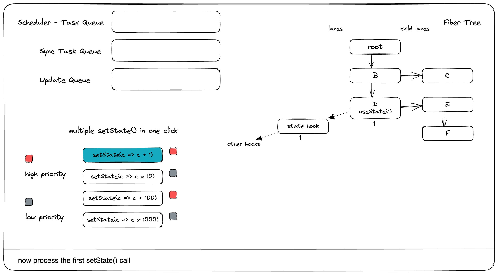

# useState()는 어떻게 동작할까?

useState()가 어떻게 동작하는지 간단하게 설명하겠습니다
React의 useState 훅이 내부적으로 어떻게 동작하는지 설명해드리도록 하겠습니다.

```ts
import { useState } from "react";

export default function App() {
  const [count, setCount] = useState(0);
  return (
    <div>
      <button onClick={() => setCount((count) => count + 1)}>
        click {count}
      </button>
    </div>
  );
}
```

먼저 코드를 분석해보면

1. `useState(0)`를 호출하여 초기값 0으로 상태를 생성합니다
2. `[count, setCount]` 구조분해를 통해 현재 상태값과 상태 업데이트 함수를 받습니다
3. `setCount(count => count + 1)`는 업데이터 함수를 사용하여 이전 상태를 기반으로 새로운 상태를 계산합니다

내부 동작 방식을 살펴보면

1. **초기화 단계**

```javascript
// React 내부 구현의 간략화된 버전
function useState(initialState) {
  const fiber = currentlyRenderingFiber; // 현재 실행중인 컴포넌트의 fiber
  const hooks = fiber.memoizedState; // 컴포넌트의 훅 리스트
  const hook = {
    memoizedState: initialState,
    queue: { pending: null },
    next: null,
  };
}
```

2. **상태 업데이트 처리**

```javascript
// setState 함수가 호출될 때의 처리
function dispatchSetState(fiber, queue, action) {
  const update = {
    action,
    next: null,
  };

  // 업데이트를 큐에 추가
  if (queue.pending === null) {
    update.next = update;
  } else {
    update.next = queue.pending.next;
    queue.pending.next = update;
  }
  queue.pending = update;

  // 리렌더링 스케줄링
  scheduleUpdateOnFiber(fiber);
}
```

3. **렌더링 과정**

- React는 컴포넌트의 fiber 노드에 연결된 훅 리스트를 순회합니다
- 각 useState 호출마다 다음 훅으로 이동하면서 상태를 관리합니다
- 이전 렌더링의 훅 순서와 현재 렌더링의 훅 순서가 일치해야 합니다 (이것이 "훅의 규칙"의 이유입니다)

4. **메모리 관리**

- 모든 훅 데이터는 fiber 노드의 `memoizedState` 필드에 연결 리스트 형태로 저장됩니다
- 컴포넌트가 언마운트되면 이 메모리는 자동으로 정리됩니다

이러한 내부 구현을 통해 useState는:

- 컴포넌트별로 독립적인 상태 관리
- 효율적인 업데이트 큐잉
- 일관된 상태 업데이트
  를 제공할 수 있습니다.

이해를 돕기 위해 시각화된 예시를 만들어보겠습니다:

이 다이어그램은 useState의 전체 생명주기를 보여줍니다. 초기 렌더링부터 상태 업데이트, 리렌더링까지의 전체 흐름을 확인할 수 있습니다.


#### useState() 초기랜더 (마운트될 때)

```typescript
function mountState<S>(
 initialState: (() => S) | S,
): [S, Dispatch<BasicStateAction<S>>] {
const hook = mountWorkInProgressHook();
// 새로운 훅이 생성됩니다

if (typeof initialState === 'function') {
 initialState = initialState();
 }
 hook.memoizedState = hook.baseState = initialState;
// hook의 memoizedState는 실제 상태 값을 보관합니다

const queue: UpdateQueue<S, BasicStateAction<S>> = {
// Update 큐는 향후 상태 업데이트를 보관합니다
// 상태를 설정할 때 상태 값이 바로 업데이트되지 않는다는 점을 기억하세요.
// 이는 업데이트마다 우선순위가 다를 수 있고, 즉시 처리될 필요가 없기 때문입니다.
// 자세한 내용은 React의 Lanes를 참고하세요
// 따라서 우리는 업데이트를 저장해두었다가 나중에 처리해야 합니다

 pending: null,
 lanes: NoLanes,
// lanes는 우선순위입니다.
// 자세한 내용은 React의 Lanes를 참고하세요

 dispatch: null,
 lastRenderedReducer: basicStateReducer,
 lastRenderedState: (initialState: any),
 };
 hook.queue = queue;
// 이 queue는 hook을 위한 업데이트 큐라는 점을 기억하세요

 const dispatch: Dispatch
 BasicStateAction<S>,
 > = (queue.dispatch = (dispatchSetState.bind(
// 이 dispatchSetState()가 실제로 우리가 상태 설정자로 받는 것입니다.
// 현재 fiber에 바인딩되어 있다는 점을 주목하세요.

null,
 currentlyRenderingFiber,
 queue,
 ): any));
 return [hook.memoizedState, dispatch];
// 여기가 우리가 useState()로부터 받는 친숙한 문법입니다
}
```

## setState()에서는 무슨 일이 일어날까?

```typescript

위의 코드에서, setState()는 내부적으로 바인딩된 dispatchSetState()라는 것을 알 수 있습니다.

function dispatchSetState<S, A>(
  fiber: Fiber,
  queue: UpdateQueue<S, A>,
  action: A,
) {
  const lane = requestUpdateLane(fiber);
// 이것은 업데이트의 우선순위를 정의합니다.
// 자세한 내용은 React의 Lanes를 참조하세요.

  const update: Update<S, A> = {
    lane,
    action,
    hasEagerState: false,
    eagerState: null,
    next: (null: any),
  };
// 네, 여기가 저장될 업데이트 객체입니다

  if (isRenderPhaseUpdate(fiber)) {
// 렌더링 중에 setState를 할 수 있습니다. 이는 유용한 패턴입니다.
// 하지만 무한 렌더링을 일으킬 수 있으니 주의하세요.

    enqueueRenderPhaseUpdate(queue, update);
  } else {
    const alternate = fiber.alternate;

    if (
      fiber.lanes === NoLanes &&
      (alternate === null || alternate.lanes === NoLanes)
// 이 조건 체크는 조기 종료(early bailout)를 위한 것입니다.
// 같은 상태를 설정할 때 아무것도 하지 않는다는 의미입니다.
// Bailout은 서브트리의 재렌더링을 건너뛰기 위해 더 깊이 들어가지 않는 것을 의미합니다.
// 재렌더링 내부에서는 재렌더링 스케줄링을 피하기 위한 것이므로 조기 종료입니다.
// 하지만 여기의 조건은 실제로 해킹입니다.
// 필요한 것보다 더 엄격한 규칙이며, 이는 React가 최선을 다해 재렌더링 스케줄링을 피하려고 하지만
// 보장은 없다는 것을 의미합니다.
// 이는 주의사항 섹션에서 자세히 다룰 것입니다.

    ) {
      // 큐가 현재 비어있으며, 이는 렌더 단계에 들어가기 전에
      // 다음 상태를 미리 계산할 수 있다는 것을 의미합니다.
      // 새로운 상태가 현재 상태와 같다면, 완전히 건너뛸 수 있을 수 있습니다.
      const lastRenderedReducer = queue.lastRenderedReducer;
      if (lastRenderedReducer !== null) {
        let prevDispatcher;
        try {
          const currentState: S = (queue.lastRenderedState: any);
          const eagerState = lastRenderedReducer(currentState, action);
          // 즉시 계산된 상태와 이를 계산하는 데 사용된 리듀서를
          // 업데이트 객체에 저장합니다.
          // 렌더 단계에 들어갈 때까지 리듀서가 변경되지 않았다면
          // 리듀서를 다시 호출하지 않고도 즉시 계산된 상태를 사용할 수 있습니다.
          update.hasEagerState = true;
          update.eagerState = eagerState;
          if (is(eagerState, currentState)) {
            // 빠른 경로입니다. React가 재렌더링하도록 스케줄링하지 않고 건너뛸 수 있습니다.
            // 컴포넌트가 다른 이유로 재렌더링되고 그때까지 리듀서가 변경된 경우
            // 이 업데이트를 나중에 리베이스해야 할 수 있습니다.
            // TODO: 이 경우에도 트랜지션을 얽히게 해야 하나요?
            enqueueConcurrentHookUpdateAndEagerlyBailout(fiber, queue, update);
            return;
// 이 return은 업데이트가 스케줄링되는 것을 방지합니다.

          }
        } catch (error) {
          // 에러를 억제합니다. 렌더 단계에서 다시 throw될 것입니다.
        } finally {
          if (__DEV__) {
            ReactCurrentDispatcher.current = prevDispatcher;
          }
        }
      }
    }
    const root = enqueueConcurrentHookUpdate(fiber, queue, update, lane);
// 이것은 업데이트를 저장합니다.
// 업데이트는 실제 재렌더링이 시작될 때 처리되어 fiber에 첨부됩니다.

    if (root !== null) {
      const eventTime = requestEventTime();
      scheduleUpdateOnFiber(root, fiber, lane, eventTime);
// 이것은 재렌더링을 스케줄링합니다. 재렌더링이 바로 일어나지 않는다는 점에 주목하세요.
// 실제 스케줄링은 React 스케줄러에 따라 달라집니다.

      entangleTransitionUpdate(root, queue, lane);
    }
  }
}
업데이트 객체가 어떻게 처리되는지 더 자세히 살펴보겠습니다.


```

```ts
// 렌더링이 진행 중이고 동시 이벤트에서 업데이트를 받으면,
// 현재 렌더링이 끝날 때까지(완료되거나 중단될 때까지) 기다린 후
// fiber/hook 큐에 추가합니다.
// 나중에 큐, fiber, 업데이트 등에 접근할 수 있도록 이 배열에 푸시합니다.
const concurrentQueues: Array<any> = [];
let concurrentQueuesIndex = 0;
let concurrentlyUpdatedLanes: Lanes = NoLanes;
export function finishQueueingConcurrentUpdates(): void {
  // 이 함수는 prepareFreshStack() 내부에서 호출됩니다.
  // 이는 재렌더링의 초기 단계 중 하나입니다.
  // 이는 재렌더링이 실제로 시작되기 전에 모든 상태 업데이트가 저장된다는 것을 의미합니다.

  const endIndex = concurrentQueuesIndex;
  concurrentQueuesIndex = 0;
  concurrentlyUpdatedLanes = NoLanes;
  let i = 0;
  while (i < endIndex) {
    const fiber: Fiber = concurrentQueues[i];
    concurrentQueues[i++] = null;
    const queue: ConcurrentQueue = concurrentQueues[i];
    concurrentQueues[i++] = null;
    const update: ConcurrentUpdate = concurrentQueues[i];
    concurrentQueues[i++] = null;
    const lane: Lane = concurrentQueues[i];
    concurrentQueues[i++] = null;
    if (queue !== null && update !== null) {
      const pending = queue.pending;
      if (pending === null) {
        // 이것은 첫 번째 업데이트입니다. 순환 리스트를 만듭니다.
        update.next = update;
      } else {
        update.next = pending.next;
        pending.next = update;
      }
      queue.pending = update;
      // 이전에 언급했던 hook.queue를 기억하시나요?
      // 여기서 저장된 업데이트가 마침내 fiber에 첨부되는 것을 볼 수 있습니다.
      // 이는 처리될 준비가 되었다는 의미입니다.
    }
    if (lane !== NoLane) {
      markUpdateLaneFromFiberToRoot(fiber, update, lane);
      // 이 함수 호출에도 주목하세요. 이는 fiber 노드 경로를 더티로 표시합니다.
      // 자세한 내용은 React의 reconciliation에서 bailout이 어떻게 작동하는지에 대한 다이어그램을 참조하세요.
    }
  }
}
function enqueueUpdate(
  fiber: Fiber,
  queue: ConcurrentQueue | null,
  update: ConcurrentUpdate | null,
  lane: Lane
) {
  // 아직 반환 경로에서 'childLanes'를 업데이트하지 마세요.
  // 이미 렌더링 중이라면, 완료될 때까지 기다리세요.
  concurrentQueues[concurrentQueuesIndex++] = fiber;
  concurrentQueues[concurrentQueuesIndex++] = queue;
  concurrentQueues[concurrentQueuesIndex++] = update;
  concurrentQueues[concurrentQueuesIndex++] = lane;
  // 내부적으로 업데이트는 리스트에 보관됩니다
  // 메시지 큐처럼, 일괄적으로 처리됩니다

  concurrentlyUpdatedLanes = mergeLanes(concurrentlyUpdatedLanes, lane);
  // fiber의 'lane' 필드는 일부 위치에서 작업이 예약되었는지 확인하는 데 사용됩니다.
  // 즉각적인 bailout을 수행하기 위해 즉시 업데이트해야 합니다.
  // TODO: 아마도 이것을 "공유된" 큐로 이동해야 할 것 같습니다.
  fiber.lanes = mergeLanes(fiber.lanes, lane);
  const alternate = fiber.alternate;
  if (alternate !== null) {
    alternate.lanes = mergeLanes(alternate.lanes, lane);
  }
  // 현재와 alternate fiber 모두 더티로 표시되는 것을 볼 수 있습니다.
  // 이는 주의사항을 이해하는 데 중요합니다.
}
```

```ts
export function enqueueConcurrentHookUpdate<S, A>(
 fiber: Fiber,
 queue: HookQueue<S, A>,
 update: HookUpdate<S, A>,
 lane: Lane,
): FiberRoot | null {
 const concurrentQueue: ConcurrentQueue = (queue: any);
 const concurrentUpdate: ConcurrentUpdate = (update: any);
 enqueueUpdate(fiber, concurrentQueue, concurrentUpdate, lane);
 return getRootForUpdatedFiber(fiber);
}
function markUpdateLaneFromFiberToRoot(
 sourceFiber: Fiber,
 update: ConcurrentUpdate | null,
 lane: Lane,
): void {
 // 소스 fiber의 lanes 업데이트
 sourceFiber.lanes = mergeLanes(sourceFiber.lanes, lane);
 let alternate = sourceFiber.alternate;
 if (alternate !== null) {
   alternate.lanes = mergeLanes(alternate.lanes, lane);
 }
// lanes가 현재 fiber와 alternate fiber 모두에 대해 업데이트되는 것에 주목하세요
// dispatchSetState()가 소스 fiber에 바인딩되어 있다는 것을 기억하세요
// 따라서 상태를 설정할 때 항상 현재 fiber 트리를 업데이트하는 것은 아닙니다.
// 둘 다 설정하면 모든 것이 올바르게 되지만, 부작용이 있습니다
// 이는 주의사항 섹션에서 다시 다룰 것입니다

 // 루트까지 부모 경로를 따라가면서 자식 lanes를 업데이트합니다.
// React bailout이 어떻게 작동하는지 참조하세요

 let isHidden = false;
 let parent = sourceFiber.return;
 let node = sourceFiber;
 while (parent !== null) {
   parent.childLanes = mergeLanes(parent.childLanes, lane);
   alternate = parent.alternate;
   if (alternate !== null) {
     alternate.childLanes = mergeLanes(alternate.childLanes, lane);
   }
   if (parent.tag === OffscreenComponent) {
     const offscreenInstance: OffscreenInstance = parent.stateNode;
     if (offscreenInstance.isHidden) {
       isHidden = true;
     }
   }
   node = parent;
   parent = parent.return;
 }
 if (isHidden && update !== null && node.tag === HostRoot) {
   const root: FiberRoot = node.stateNode;
   markHiddenUpdate(root, update, lane);
 }
}
export function scheduleUpdateOnFiber(
 root: FiberRoot,
 fiber: Fiber,
 lane: Lane,
 eventTime: number,
) {
 checkForNestedUpdates();
 // 루트에 대기 중인 업데이트가 있다고 표시합니다.
 markRootUpdated(root, lane, eventTime);
 if (
   (executionContext & RenderContext) !== NoLanes &&
   root === workInProgressRoot
 ) {
   // 렌더 단계 동안 업데이트된 lanes를 추적합니다
   workInProgressRootRenderPhaseUpdatedLanes = mergeLanes(
     workInProgressRootRenderPhaseUpdatedLanes,
     lane,
   );
 } else {
   if (root === workInProgressRoot) {
     // 렌더링 중인 트리에 대한 업데이트를 받았습니다.
     // 이 루트에서 인터리브된 업데이트 작업이 있었다고 표시합니다.
     // deferRenderPhaseUpdateToNextBatch 플래그가 꺼져 있고
     // 이것이 렌더 단계 업데이트가 아닌 경우를 제외하고요.
     // 그 경우, 이전 버전과의 호환성을 위해
     // 렌더 단계 업데이트를 인터리브된 것처럼 취급하지 않습니다.
     if (
       deferRenderPhaseUpdateToNextBatch ||
       (executionContext & RenderContext) === NoContext
     ) {
       workInProgressRootInterleavedUpdatedLanes = mergeLanes(
         workInProgressRootInterleavedUpdatedLanes,
         lane,
       );
     }
     if (workInProgressRootExitStatus === RootSuspendedWithDelay) {
       // 루트가 이미 지연되어 일시 중단되었습니다.
       // 이는 이 렌더링이 확실히 완료되지 않을 것임을 의미합니다.
       // 새로운 업데이트가 있으므로, 들어오는 업데이트를 표시하기 전에
       // 지금 일시 중단된 것으로 표시하겠습니다.
       // 이는 현재 렌더링을 중단하고 업데이트로 전환하는 효과가 있습니다.
       markRootSuspended(root, workInProgressRootRenderLanes);
     }
   }
   ensureRootIsScheduled(root, eventTime);
// scheduleUpdateOnFiber()에서 신경 써야 할 유일한 줄입니다.
// 대기 중인 업데이트가 있으면 재렌더링이 예약되도록 합니다.
// 업데이트는 아직 처리되지 않았습니다. 실제 재렌더링이 아직 시작되지 않았기 때문입니다.
// 실제 재렌더링의 시작은 이벤트의 카테고리와 스케줄러의 상태와 같은 여러 요소에 따라 달라집니다.
// 이 함수를 많이 만났습니다.
// useTransition()이 내부적으로 어떻게 작동하는지 참조하여 더 자세히 알아볼 수 있습니다.

   if (
     lane === SyncLane &&
     executionContext === NoContext &&
     (fiber.mode & ConcurrentMode) === NoMode &&
     // act를 레거시 모드에서도 batchedUpdates 내부에 있는 것처럼 취급합니다.
     !(__DEV__ && ReactCurrentActQueue.isBatchingLegacy)
   ) {
     // 이미 작업 중이거나 배치 내부가 아닌 한 동기 작업을 지금 플러시합니다.
     // 이는 의도적으로 scheduleCallbackForFiber 대신 scheduleUpdateOnFiber 내부에 있습니다.
     // 즉시 플러시하지 않고도 콜백을 예약할 수 있는 기능을 보존하기 위해서입니다.
     // 우리는 레거시 모드의 역사적 동작을 보존하기 위해
     // 사용자가 시작한 업데이트에 대해서만 이렇게 합니다.
     resetRenderTimer();
     flushSyncCallbacksOnlyInLegacyMode();
   }
 }
}
```

## 재렌더링 시의 useState()

```ts

업데이트가 저장된 후, 이제 실제로 업데이트를 실행하고 상태 값을 업데이트할 시간입니다.
이는 실제로 재렌더링 시의 useState()에서 발생합니다.

function updateState<S>(
 initialState: (() => S) | S,
): [S, Dispatch<BasicStateAction<S>>] {
 return updateReducer(basicStateReducer, (initialState: any));
}

function updateReducer<S, I, A>(
 reducer: (S, A) => S,
 initialArg: I,
 init?: I => S,
): [S, Dispatch<A>] {
 const hook = updateWorkInProgressHook();
// 이는 이전에 생성된 훅을 가져와서 값을 얻을 수 있게 합니다

 const queue = hook.queue;
// 모든 업데이트를 보관하는 업데이트 큐를 기억하세요
// useState()가 재렌더링이 시작된 후에 호출되므로, 저장된 업데이트들이 fiber로 이동됩니다

 if (queue === null) {
   throw new Error(
     'Should have a queue. This is likely a bug in React. Please file an issue.',
   );
 }
 queue.lastRenderedReducer = reducer;
 const current: Hook = (currentHook: any);

 // 기본 상태의 일부가 아닌 마지막 리베이스 업데이트
 let baseQueue = current.baseQueue;
// baseQueue는 설명이 필요합니다.
// 가장 좋은 경우, 업데이트가 처리되면 그냥 버릴 수 있습니다.
// 하지만 서로 다른 우선순위의 여러 업데이트가 있을 수 있기 때문에,
// 나중에 처리하기 위해 일부를 건너뛰어야 할 수 있습니다.
// 그래서 이들이 baseQueue에 저장되는 것입니다.
// 또한 처리된 업데이트의 경우에도, 최종 상태가 올바른지 확인하기 위해
// 업데이트가 baseQueue에 들어가면 이후의 모든 업데이트도 반드시 포함되어야 합니다.
// 예: 상태 값이 1이고, 3개의 업데이트가 있습니다: +1(낮음), *10(높음), -2(낮음)
// *10이 높은 우선순위이므로 이를 처리합니다, 1 * 10 = 10
// 나중에 낮은 우선순위를 처리할 때,
// *10을 큐에 넣지 않으면, 1 + 1 - 2 = 0이 됩니다
// 하지만 우리가 필요한 것은 (1 + 1) * 10 - 2 입니다.

 // 아직 처리되지 않은 마지막 대기 업데이트
 const pendingQueue = queue.pending;
 if (pendingQueue !== null) {
   // 아직 처리되지 않은 새 업데이트가 있습니다.
   // 이들을 기본 큐에 추가하겠습니다.
   if (baseQueue !== null) {
     // 대기 큐와 기본 큐를 병합합니다.
     const baseFirst = baseQueue.next;
     const pendingFirst = pendingQueue.next;
     baseQueue.next = pendingFirst;
     pendingQueue.next = baseFirst;
   }
   current.baseQueue = baseQueue = pendingQueue;
   queue.pending = null;
// pending 큐가 지워지고 baseQueue로 병합됩니다
 }

 if (baseQueue !== null) {
   // 처리할 큐가 있습니다.
   const first = baseQueue.next;
   let newState = current.baseState;
   let newBaseState = null;
   let newBaseQueueFirst = null;
   let newBaseQueueLast = null;
// baseQueue를 처리한 후, 새로운 baseQueue가 생성됩니다

   let update = first;
   do {
// 이 do...while 루프는 모든 업데이트를 처리하려고 시도합니다

     // 이 업데이트가 트리가 숨겨져 있는 동안 만들어졌는지 확인합니다.
     // 만약 그렇다면, 이는 "기본" 업데이트가 아니며
     // Offscreen 트리에 들어갈 때 renderLanes에 추가된
     // 추가 기본 lanes를 무시해야 합니다.
     const shouldSkipUpdate = isHiddenUpdate
       ? !isSubsetOfLanes(getWorkInProgressRootRenderLanes(), updateLane)
       : !isSubsetOfLanes(renderLanes, updateLane);
     if (shouldSkipUpdate) {
       // 우선순위가 충분하지 않습니다. 이 업데이트를 건너뜁니다.
       // 이것이 첫 번째로 건너뛴 업데이트라면,
       // 이전 업데이트/상태가 새로운 기본 업데이트/상태가 됩니다.
// 네, 낮은 우선순위의 것입니다

       const clone: Update<S, A> = {
         lane: updateLane,
         action: update.action,
         hasEagerState: update.hasEagerState,
         eagerState: update.eagerState,
         next: (null: any),
       };
       if (newBaseQueueLast === null) {
         newBaseQueueFirst = newBaseQueueLast = clone;
         newBaseState = newState;
       } else {
         newBaseQueueLast = newBaseQueueLast.next = clone;
       }
// 업데이트가 처리되지 않았기 때문에 새로운 baseQueue에 넣어집니다

       // 큐의 남은 우선순위를 업데이트합니다.
       // TODO: 이를 누적할 필요가 없습니다. 대신,
       // 원래 lanes에서 renderLanes를 제거할 수 있습니다.
       currentlyRenderingFiber.lanes = mergeLanes(
         currentlyRenderingFiber.lanes,
         updateLane,
       );
       markSkippedUpdateLanes(updateLane);
     } else {
       // 이 업데이트는 충분한 우선순위를 가지고 있습니다.
       if (newBaseQueueLast !== null) {

         const clone: Update<S, A> = {
           // 이 업데이트는 커밋될 것이므로 절대 uncommit하고 싶지 않습니다.
           // NoLane을 사용하는 것이 작동하는 이유는 0이 모든 비트마스크의 부분집합이므로
           // 위의 검사에서 절대 건너뛰지 않을 것이기 때문입니다.
           lane: NoLane,
           action: update.action,
           hasEagerState: update.hasEagerState,
           eagerState: update.eagerState,
           next: (null: any),
         };
         newBaseQueueLast = newBaseQueueLast.next = clone;
       }
// 전에 baseQueue에 대해 설명했듯이,
// 여기서는 newBaseQueue가 비어있지 않으면
// 이후의 모든 업데이트를 나중에 사용하기 위해 저장해야 한다고 말합니다

       // 이 업데이트를 처리합니다.
       if (update.hasEagerState) {
         // 이 업데이트가 상태 업데이트이고(리듀서가 아님) 즉시 처리되었다면,
         // 즉시 계산된 상태를 사용할 수 있습니다
         newState = ((update.eagerState: any): S);
       } else {
         const action = update.action;
         newState = reducer(newState, action);
       }
     }
     update = update.next;
   } while (update !== null && update !== first);
   if (newBaseQueueLast === null) {
     newBaseState = newState;
   } else {
     newBaseQueueLast.next = (newBaseQueueFirst: any);
   }
   // fiber가 작업을 수행했다고 표시합니다.
   // 단, 새로운 상태가 현재 상태와 다른 경우에만 해당됩니다.
   if (!is(newState, hook.memoizedState)) {
     markWorkInProgressReceivedUpdate();
// 이는 재렌더링 중에 상태 변경이 없으면 실제로 bailout됩니다(조기 bailout이 아님).
   }
   hook.memoizedState = newState;
// 마침내 새로운 상태가 설정됩니다

   hook.baseState = newBaseState;
   hook.baseQueue = newBaseQueueLast;
// 다음 라운드의 재렌더링을 위해 새로운 baseQueue가 설정됩니다

   queue.lastRenderedState = newState;
 }
 if (baseQueue === null) {
   // queue.lanes는 트랜지션을 얽히게 하는 데 사용됩니다.
   // 큐가 비어있으면 0으로 다시 설정할 수 있습니다.
   queue.lanes = NoLanes;
 }
 const dispatch: Dispatch<A> = (queue.dispatch: any);
 return [hook.memoizedState, dispatch];
// 이제 새로운 상태가 있습니다! 그리고 dispatch()는 안정적입니다!
}
```

### useState의 동작방식을 사진으로 보면

<div align="center">

<br/>
<br/>


<br/>
<br/>


<br/>
<br/>


<br/>
<br/>


<br/>
<br/>


<br/>
<br/>


<br/>
<br/>


<br/>
<br/>


<br/>
<br/>


<br/>
<br/>


<br/>
<br/>


<br/>
<br/>


<br/>
<br/>


<br/>
<br/>


<br/>
<br/>


<br/>
<br/>


<br/>
<br/>


<br/>
<br/>


<br/>
<br/>


</div>

### 주의사항

### 상태 업데이트는 동기적이지 않습니다

set 함수는 다음 렌더링을 위해서만 상태 변수를 업데이트합니다. set 함수를 호출한 후에 상태 변수를 읽으면, 여전히 호출 전 화면에 있던 이전 값을 얻게 됩니다.

이는 이해하기 쉽습니다. 우리는 이미 `setState()`가 어떻게 다음 틱에서 재렌더링을 예약하는지 봤습니다. 상태 업데이트는 `setState()`에서가 아닌 `useState()`에서 이루어지기 때문에 동기적이지 않으며, 업데이트된 값은 다음 렌더링에서만 얻을 수 있습니다.

### 같은 값으로 setState()를 호출해도 여전히 재렌더링이 발생할 수 있습니다

제공하는 새 값이 Object.is 비교에 의해 결정된 현재 상태와 동일한 경우, React는 컴포넌트와 그 자식들의 재렌더링을 건너뜁니다. 이는 최적화입니다. 하지만 일부 경우에는 React가 자식들을 건너뛰기 전에 여전히 컴포넌트를 호출해야 할 수도 있습니다. 이는 여러분의 코드에 영향을 미치지 않아야 합니다.
